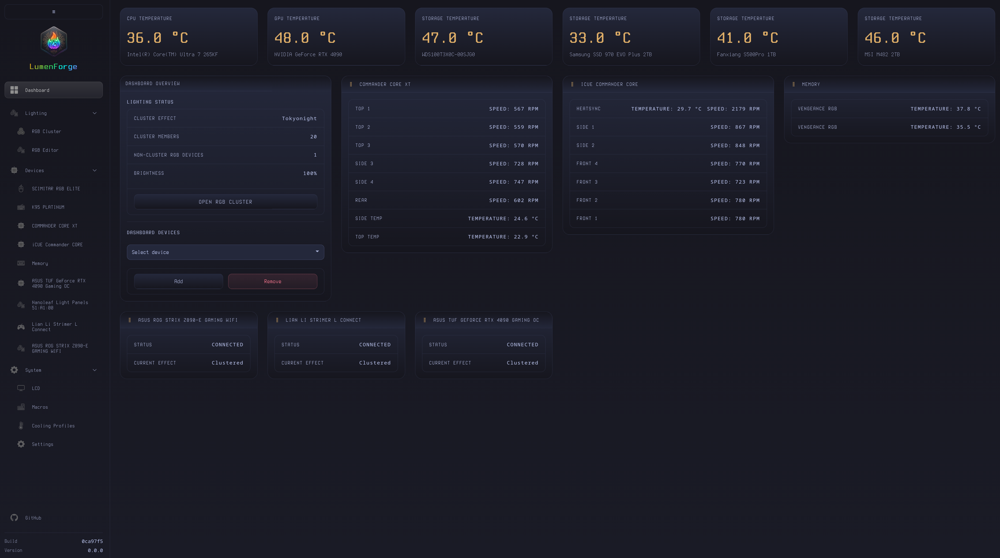

# LumenForge

LumenForge is an experimental Linux RGB, cooling, and device-control hub built as a fork of [OpenLinkHub](https://github.com/jurkovic-nikola/OpenLinkHub). It keeps OpenLinkHub's Corsair and Linux control foundation while adding OpenRGB-backed device import, RGB Cluster workflows, dashboard improvements, and mixed-device lighting control.

LumenForge complements OpenLinkHub and OpenRGB; it does not replace either project. Hardware support varies, and OpenRGB-imported devices depend on both OpenRGB support and the metadata LumenForge can obtain for that device.

## Features

- Web UI at `http://127.0.0.1:27003`
- RGB Cluster for synchronizing lighting across mixed supported devices
- OpenRGB-backed device import where supported by OpenRGB and available import metadata
- Dashboard overview with grouped device cards, lighting status, and card ordering
- Corsair hardware support inherited from OpenLinkHub
- Cooling profiles, fan curves, pumps, temperature sensors, and system metrics where supported
- RGB editor and custom lighting effects
- LCD support where supported
- Inherited keyboard, mouse, headset, memory, motherboard PWM, XENEON, and other device support where supported

Related documentation:

- [Supported device list](docs/supported-devices.md)
- [OpenRGB device import](docs/openrgb-import.md)
- [Memory DDR4 / DDR5](docs/memory-configuration.md)
- [Motherboard PWM](docs/motherboard-pwm.md)
- [SCUF controller audio configuration](docs/scuf-controller.md)
- [XENEON EDGE KDE](docs/xeneon-edge-kde.md)
- [HTTP API](api/README.md)



## Project Status

LumenForge exists because I wanted the OpenLinkHub-style UI and control model with broader mixed-device RGB control. OpenRGB import brings supported OpenRGB-backed devices into LumenForge's dashboard and RGB Cluster workflows.

This is experimental alpha software developed and tested primarily against my own Linux setup. Use it at your own risk. LumenForge is not an official Corsair, OpenRGB, or OpenLinkHub product.

## Alpha Installation

The currently supported alpha installation path is to build from source. Package repositories, release archives, containers, and automatic remote installation are not yet validated for LumenForge.

### Requirements

- Go 1.25 or newer
- A C compiler and `pkg-config`
- libudev development files
- PipeWire development files
- USB utilities

Debian or Ubuntu:

```bash
sudo apt-get update
sudo apt-get install build-essential git libudev-dev libpipewire-0.3-dev pkg-config usbutils
```

Fedora or other RPM-based distributions:

```bash
sudo dnf install gcc git libudev-devel pipewire-devel pkg-config usbutils
```

### Build

```bash
git clone https://github.com/Alaric07/LumenForge.git
cd LumenForge
CGO_CFLAGS_ALLOW='-fno-strict-overflow' go build -o LumenForge
```

Run directly from the repository:

```bash
./LumenForge
```

Hardware access may require appropriate udev permissions. To install LumenForge under `/opt/LumenForge` as a system service instead:

```bash
chmod +x install.sh
sudo ./install.sh
```

Then open `http://127.0.0.1:27003`.

### Immutable Distributions

Immutable distributions may require a user-space installation flow, but this has not yet been validated for LumenForge.

### Distribution Status

The following installation channels are not yet validated or advertised as supported for this alpha:

- `.deb` and `.rpm` packages
- PPA and Copr repositories
- GitHub release tarballs
- `remote-install.sh`
- User-space installation on immutable distributions

Docker support is also not yet validated. The inherited `Dockerfile` may require review before use.

## Configuration

LumenForge creates `config.json` on first run. It is stored in the working directory, which is `/opt/LumenForge/config.json` for the system-service installation. Current generated defaults are:

```json
{
  "debug": false,
  "listenPort": 27003,
  "listenAddress": "127.0.0.1",
  "cpuSensorChip": "",
  "manual": false,
  "frontend": true,
  "metrics": false,
  "memory": false,
  "memorySmBus": "i2c-0",
  "memoryType": 5,
  "exclude": [],
  "memorySku": "",
  "resumeDelay": 15000,
  "logFile": "",
  "logLevel": "info",
  "enhancementKits": "",
  "temperatureOffset": 0,
  "amdGpuIndex": 0,
  "amdsmiPath": "",
  "checkDevicePermission": false,
  "graphProfiles": true,
  "cpuTempFile": "",
  "ramTempViaHwmon": true,
  "nvidiaGpuIndex": [0],
  "defaultNvidiaGPU": 0,
  "openRGBPort": 6742,
  "enableGamepad": true,
  "enableMotherboard": false,
  "motherboardBiosOnExit": false,
  "memoryRegisterOverride": "",
  "enableSystemTray": false
}
```

`openRGBPort` is the port used to connect to an external OpenRGB server for device discovery and import. See the [OpenRGB import guide](docs/openrgb-import.md) for setup and limitations.

## Progressive Web App

The web UI can be installed as a progressive web app in supported Chromium-based browsers. Firefox does not currently provide the same PWA installation support.

## Uninstall

Back up any desired runtime configuration from `/opt/LumenForge` before removing a system-service installation.

```bash
sudo systemctl stop LumenForge.service
sudo systemctl disable LumenForge.service
sudo rm -f /etc/systemd/system/LumenForge.service
sudo rm -f /usr/lib/systemd/system/LumenForge.service
sudo systemctl daemon-reload
sudo rm -f /etc/udev/rules.d/99-lumenforge.rules
sudo udevadm control --reload-rules
sudo udevadm trigger
sudo rm -rf /opt/LumenForge
```

## Runtime Notes

- LCD images and animations are stored in `/opt/LumenForge/database/lcd/images/` for a system installation.
- The dashboard is available at `http://127.0.0.1:27003/`.
- Per-device RGB state is generated under `database/rgb/` and can be edited through the RGB editor.
- LumenForge includes an HTTP server for device overview and control; see the [API documentation](api/README.md).
